# StudyFocus

StudyFocus adalah aplikasi Flutter yang membantu pengguna fokus belajar melalui
timer fokus, pemantauan sensor gyroscope dan cahaya, serta pengingat belajar
berbasis notifikasi.

## Tujuan

Membantu pengguna menjaga konsentrasi belajar dengan cara:

- Menjalankan timer fokus yang memantau kondisi perangkat.
- Menghentikan timer otomatis saat terdeteksi gerakan atau cahaya terlalu redup.
- Mengirim notifikasi pengingat belajar terjadwal.

## Fitur Utama

- **Timer fokus** dengan aktivitas (nama, deskripsi, durasi) yang disimpan.
- **Auto-pause berbasis sensor**:
  - Gyroscope: timer otomatis dipause saat perangkat bergerak.
  - Sensor cahaya: timer dipause saat ruangan terlalu gelap.
- **Notifikasi** untuk peringatan auto-pause dan pengingat belajar.
- **Pengingat belajar mingguan** dengan hari dan jam yang bisa diatur.
- **Target belajar harian** untuk memantau total menit aktivitas.
- **Riwayat aktivitas** lengkap dengan detail durasi, waktu, kategori, dan catatan.

## Alur Penggunaan Singkat

1. Login atau registrasi akun.
2. Buat aktivitas fokus dan tentukan durasinya.
3. Mulai timer fokus.
4. Jika ada gerakan atau cahaya terlalu redup, timer akan pause otomatis.
5. Setelah timer selesai, pengguna dapat menambahkan catatan aktivitas.
6. Atur pengingat belajar mingguan dari menu Pengingat.

## Teknologi & Layanan

- Flutter (Material 3)
- Firebase Authentication
- Cloud Firestore (aktivitas, kategori, pengingat, target harian)
- Firebase Storage (penyimpanan foto/catatan aktivitas)
- Awesome Notifications (pengingat & peringatan timer)
- Sensors Plus (gyroscope)
- Light Sensor (deteksi cahaya)

## Struktur Layar Utama

- **Login** dan **Register**
- **Home** (target harian, daftar aktivitas, buat aktivitas)
- **Timer** (status fokus, kontrol pause/lanjut/stop, auto-pause sensor)
- **Reminders** (buat, aktif/nonaktifkan, hapus pengingat)

## Screenshot

<table>
  <tr>
    <td>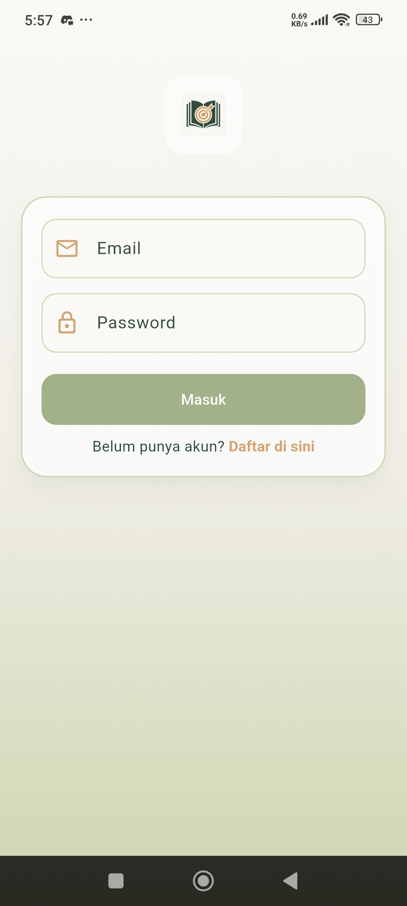</td>
    <td>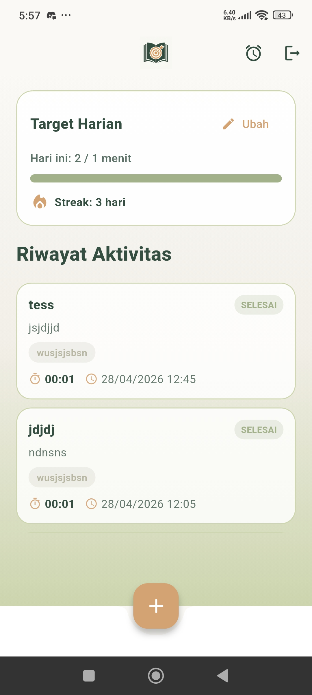</td>
  </tr>
  <tr>
    <td>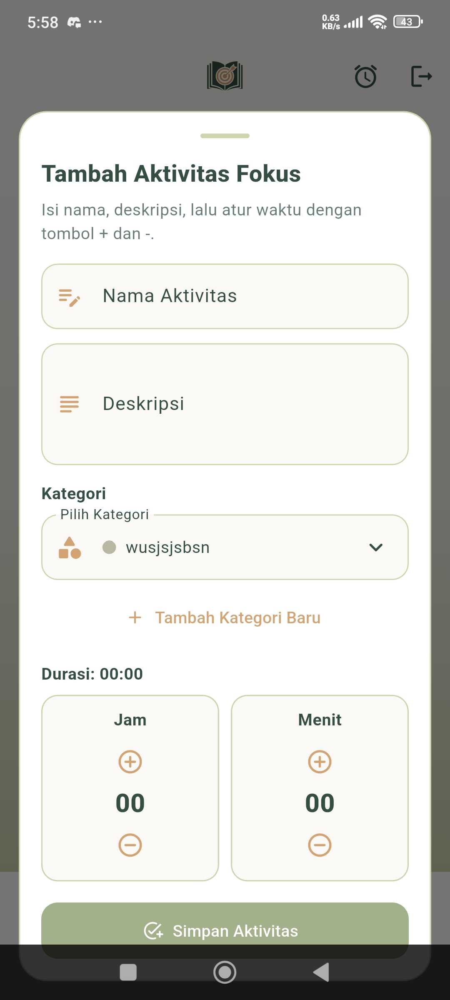</td>
    <td>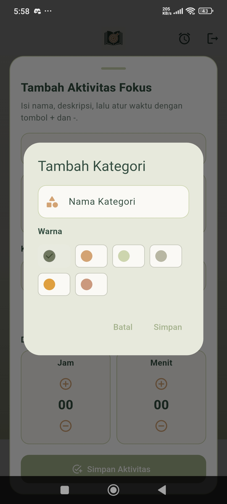</td>
  </tr>
  <tr>
    <td>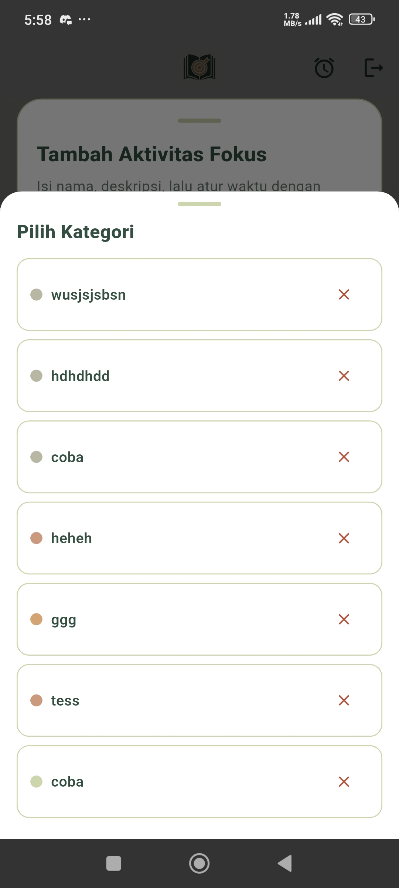</td>
    <td>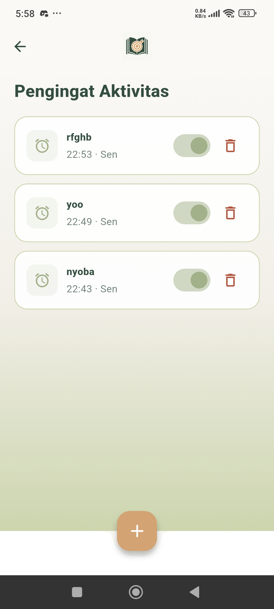</td>
  </tr>
  <tr>
    <td>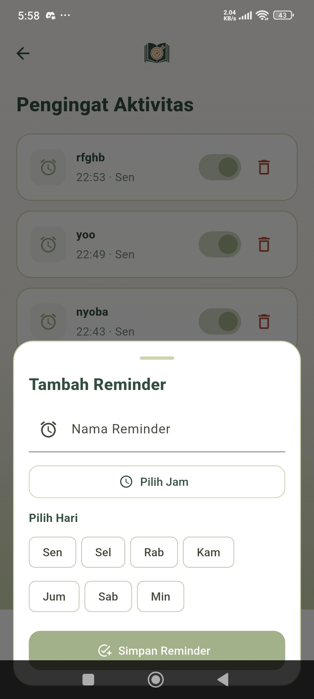</td>
    <td>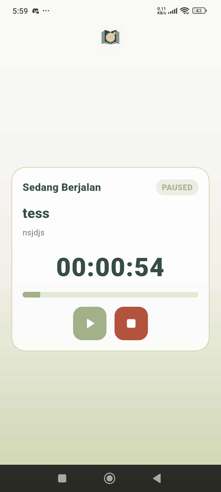</td>
  </tr>
  <tr>
    <td>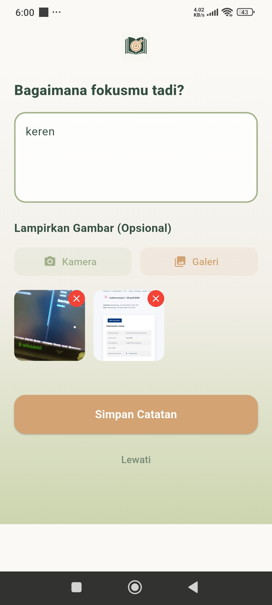</td>
    <td>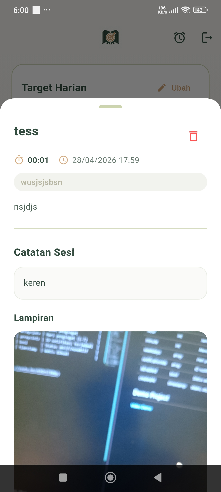</td>
  </tr>
  <tr>
    <td>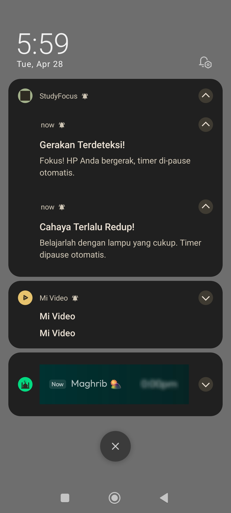</td>
    <td>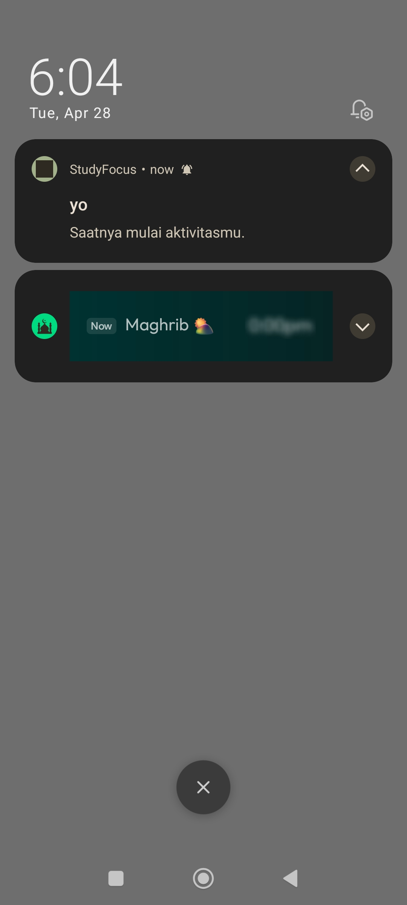</td>
  </tr>
</table>

## Struktur Database (Cloud Firestore)

Koleksi dan field utama yang digunakan:

### users

| Field              | Tipe      | Keterangan                    |
| ------------------ | --------- | ----------------------------- |
| dailyTargetMinutes | int       | Target menit belajar per hari |
| updatedAt          | timestamp | Waktu terakhir update         |

### activities

| Field             | Tipe      | Keterangan                   |
| ----------------- | --------- | ---------------------------- |
| name              | string    | Nama aktivitas               |
| description       | string    | Deskripsi aktivitas          |
| durationInSeconds | int       | Durasi aktivitas dalam detik |
| durationInMinutes | int       | Durasi aktivitas dalam menit |
| status            | string    | `running` atau `completed`   |
| userId            | string    | ID user pemilik aktivitas    |
| categoryId        | string    | ID kategori (opsional)       |
| createdAt         | timestamp | Waktu dibuat                 |
| completedAt       | timestamp | Waktu selesai (opsional)     |

### categories

| Field      | Tipe      | Keterangan               |
| ---------- | --------- | ------------------------ |
| name       | string    | Nama kategori            |
| colorValue | int       | Warna kategori (ARGB)    |
| userId     | string    | ID user pemilik kategori |
| createdAt  | timestamp | Waktu dibuat             |

### reminders

| Field           | Tipe       | Keterangan               |
| --------------- | ---------- | ------------------------ |
| title           | string     | Judul reminder           |
| userId          | string     | ID user pemilik reminder |
| hour            | int        | Jam pengingat            |
| minute          | int        | Menit pengingat          |
| weekdays        | array<int> | Hari pengingat (1-7)     |
| notificationIds | array<int> | ID notifikasi terjadwal  |
| isEnabled       | bool       | Status aktif/nonaktif    |
| createdAt       | timestamp  | Waktu dibuat             |

## Demo Project

[Video Demo](https://youtu.be/eEXOrETRVNo)
